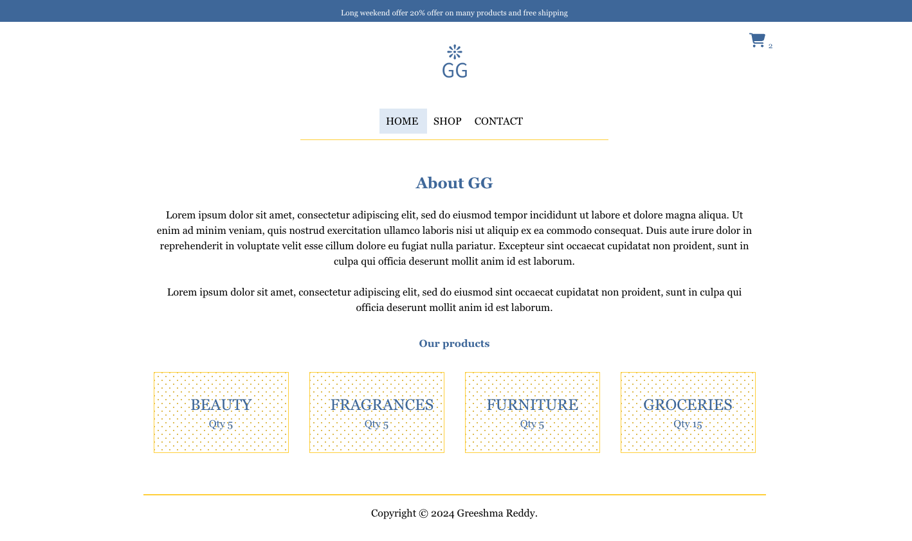
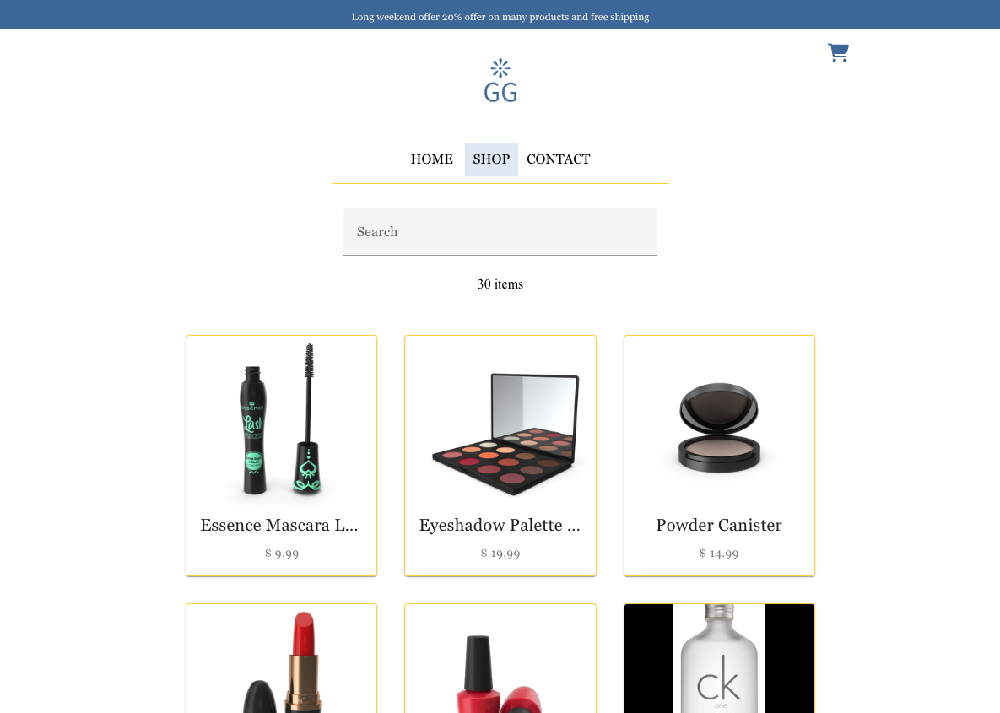
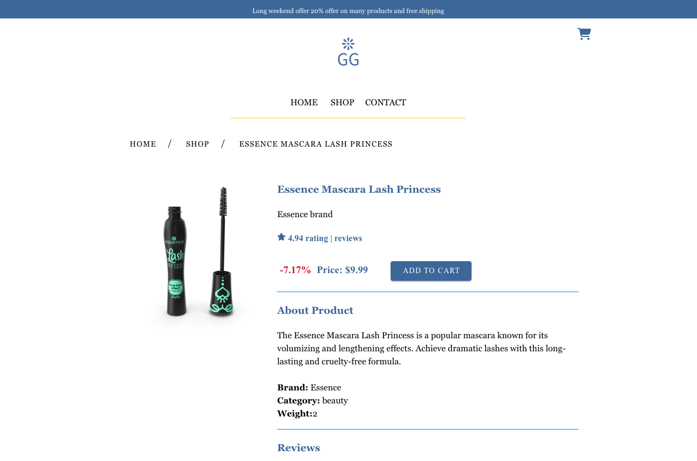
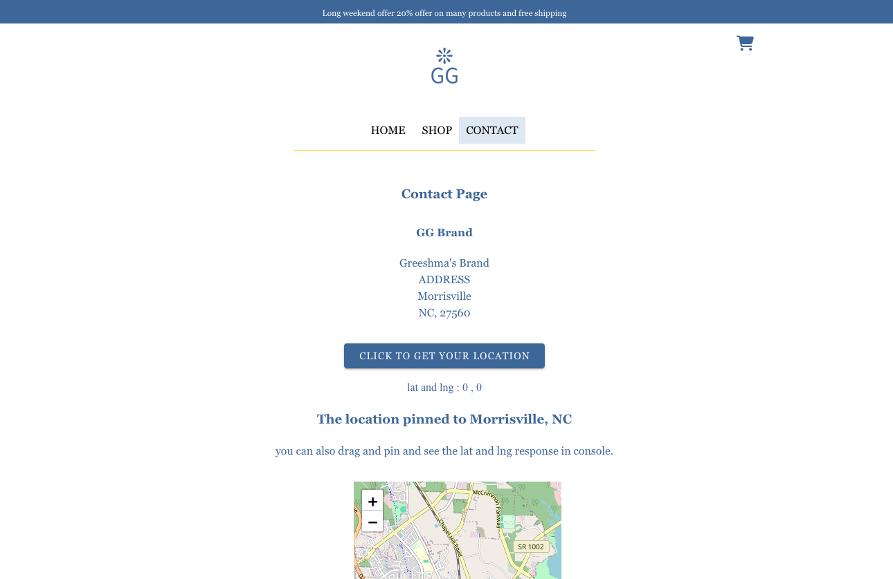
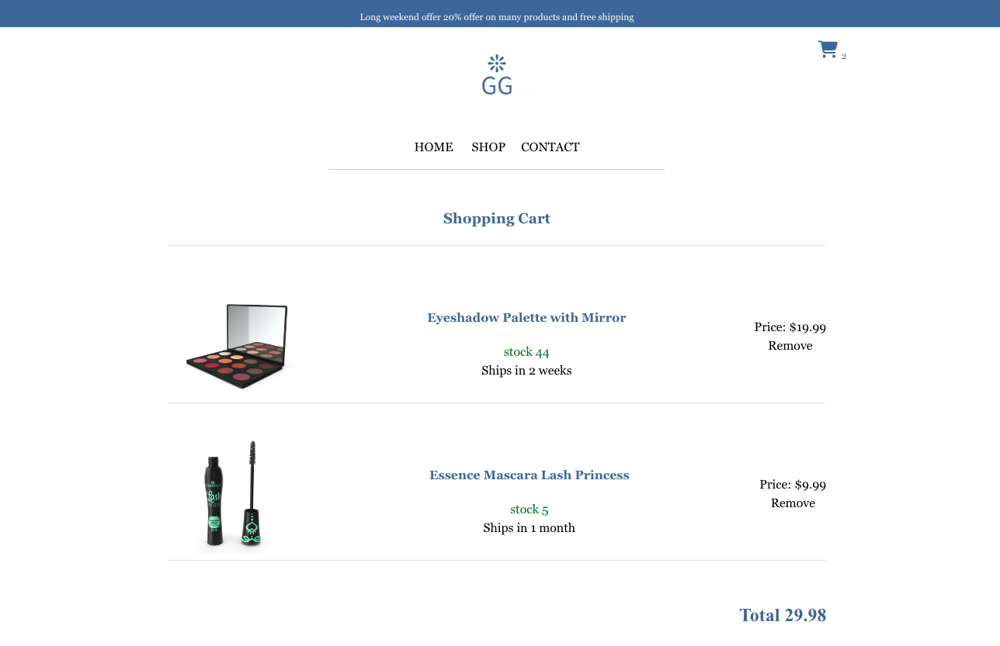

# Documentation

## Setup

```sh
npm install
```

```sh
npm run dev
```

```sh
npm run test

```

## Description.

Created this GG App using vue, vuex, pinia, vite, Fetch, es6+, leaflet and some npm packages.

Its a responsive shopping app.


### Home-page: 

- on the home page there is description and product categories and quantities that are got from store gettere.


### Shop-page: 

- There is a products list display. 
- you can search for products.
- you will go to product page if you click on a product.


### Product-page

- on the product page you can see the product details
- and add the product to cart

### Cart-page

- on the cart page you can see the added products and its details ( stock, shipping)
- and the total of the products


the app is responsive for laptops and mobiles. 


Bonus Points
- API error handling - I have added the async, await and try catch, error throwing.
- State management - added state management pinia : state, actions, getters,
- ES6+ features (example: async/await) - used async await, variables, arrow functions etc.
- Modern CSS patterns : used min, max and media queries. 
- Server Side Rendering : due to short-time I left it with setup.  added server.js, entry-client and entry-server.
- Page performance/Lighthouse: tried browser lighthouse. 
- Accessibility and SEO: used all the semantic elements, added alt for images, used readable colors and background.
- Performance-optimized API usage : used API in an action with async await and error catching.
- Lazy-loading non critical UI components: added lazy loading in the router via import at component
- Unit tests : added unit tests
- CSS UI Patterns : i have used css pattern on the home page for category tiles
- Usage of webpack for bundling and code splitting : used vite.

and I tried to design the layout well and  metch the colors.
added responsiveness.

### References:

- amazon products details page and cart page layout designs.
- refered Christina moss page for the layout


## Progress


first Day: vue and dependency set up
- Components
- routing, lazy loading.
- Styles
- API: call, error handling , asyn await
- Event handling: onclick, add, remove
- State management: store: state counter, fetchProductsFromAPI action, cart add and remove.
- Server-side rendering but some module errors

Second day: 
- some conditional renderings
- ES6+ variables, array, object methods, async await
- Error handling :  using Vue.config.errorHandler on main.js 
- Error boundary for productItem.
- Router Error handling for now.
- Light House: Accessibilty and SEO practices checked and Fixed

Third day:
- product Details, Cart details pages improvements
- Layout fixes and styling.
- some data and state management.
- SSR code added.

Fourth day:
- test setup and added tests.
- bundling and code splitting in vite.
- product details fixes
- added animations
- css: modern methods min, max, animation, media queries, made it responsive.
- added CSS pattern on home page cards.
- Added Geolocation on Contact page using lat and lng and Leaflet.
- Added product categories getter and added data.


# UI Screens


## Home page



## Shop page



## product Details



## Contact page



## Cart view




